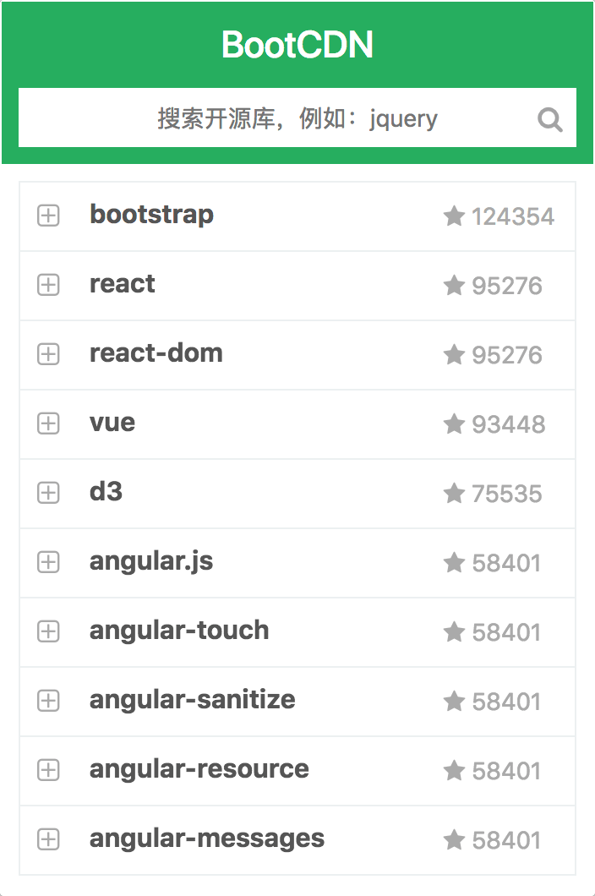
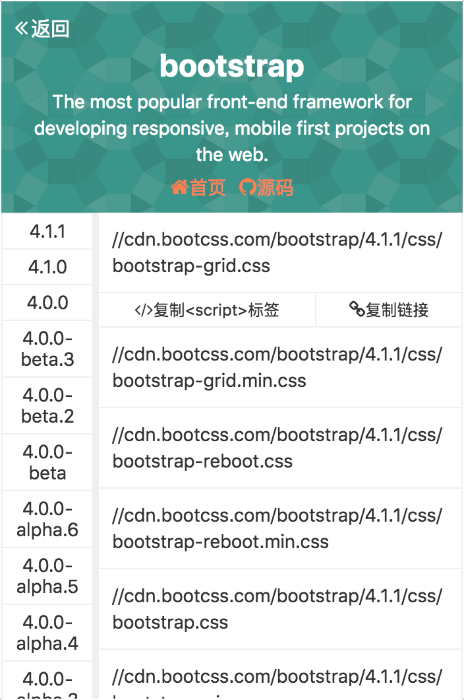

# Chrome Extension BootCDN

BootCDN(http://www.bootcdn.cn/) 的Chrome扩展程序.

## 截图

### 首页

<div align="center">

</div>


### 详情页

<div align="center">

</div>


## 使用

```bash
git clone 
cd chrome-extension-bootcdn
npm i

# 开发环境
npm run dev

#生产环境
npm run build
```

## 遇到的问题

* reqwest不能用，会报“options 403”错误，但是fetch就可以用，不知道为什么？
* 生产环境webpack不能用optimization配置，暂时不知道原因

## 开源协议

MIT